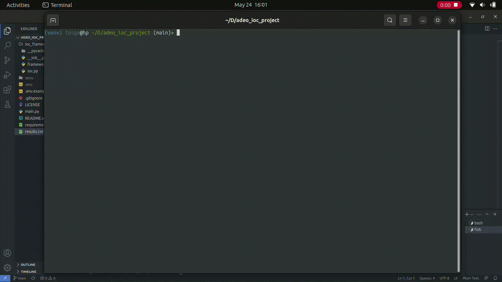

# adeo_ioc_project


#### Installion

Intallion requires [Python](https://python.org/) v3.6+

```sh
python3 -m venv venv
touch .env
pip install -r requirements.txt
python main.py

```

#### Project Structure

    ioc.py:
        Bu dosya IOC (Indicator of Compromise) sınıflarını içerir.
        IOC adlı bir temel sınıf tanımlanır. Diğer IOC sınıfları bu sınıftan türetilir ve query ve print_results metodlarını uygular.
        IP, Domain ve SHA256 adlı IOC alt sınıfları tanımlanır. Her biri farklı tipte IOC'leri temsil eder ve query metoduyla ilgili platformlardan IOC sorgularını gerçekleştirir.
        IOC sınıfları, verilen değerlerle oluşturulduğunda ilgili platforma sorgu yapmak için HTTP istekleri kullanır ve sonuçları results listesine kaydeder.

    framework.py:
        Bu dosya IOCFramework sınıfını içerir.
        IOCFramework sınıfı, IOC'leri yönetmek ve sorgulamak için kullanılır.
        add_ioc metoduyla IOC'leri ekleyebilir ve query_all metoduyla eklenen tüm IOC'leri sorgulayabilirsiniz.
        print_results_all metoduyla tüm IOC'lerin sonuçlarını yazdırabilirsiniz.
        write_results metofu ile de sonuçları bir txt dosyasına yazdırabilirsiniz.

    __init__.py:
        Bu dosya bir Python paketini temsil eder. Paketin içindeki modüllere erişimi sağlar.

    main.py:
        Bu dosya, IOCFramework kullanarak IOC'leri sorgulayan ve sonuçları yazdıran ana uygulamayı içerir.
        main fonksiyonu, IOCFramework örneğini oluşturur, IOC'leri ekler, sorgular ve sonuçları yazdırır.
        Kullanıcıya platform ve işlem seçeneklerini sorar ve seçilen seçeneklere göre IOC'leri oluşturur ve işler.
        Uygulama, main fonksiyonunu çalıştırarak başlatılır.


#### Project preview
